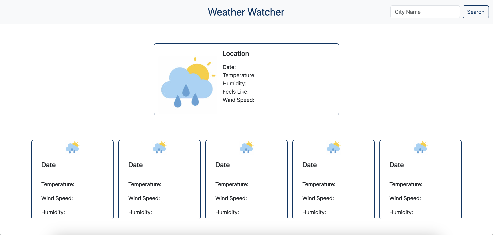
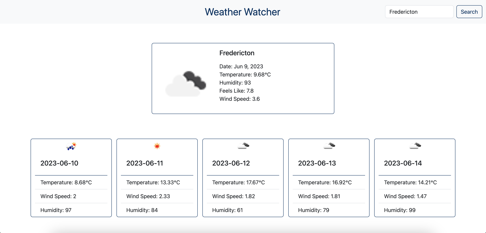

# Weather Watcher Website (BootcampChallenge6 - APIs)

## Project Description

In this challenge I used the openweather API to pull data to my website to show the currect weather and predicted forecasts for the next 5 days. Using a boostrap framework to set the styling of the website I used JavaScript to create a dynamically functioning website based off of a user's city searches. 

## Future Features

If development for this project went furture I would like to:
- Eventually incorporate more times into the data that is being pulled so the weather readings can be more accurate for the 'Current Weather' section
- Add in custom graphics that correspond to the API's icon codes to create a more modern and cohesive look for the website itself
- Upon opening the site the weather will be displayed automatically based on the user's location 
- a color changing nav bar that will be associated with the weather in the location that is being searched 

## Deployed Link and Website Preview

Site Link: https://nikkivno.github.io/WeatherWatcher_BootcampChallenge6/

Before Search:

After Search:

## License 

MIT License